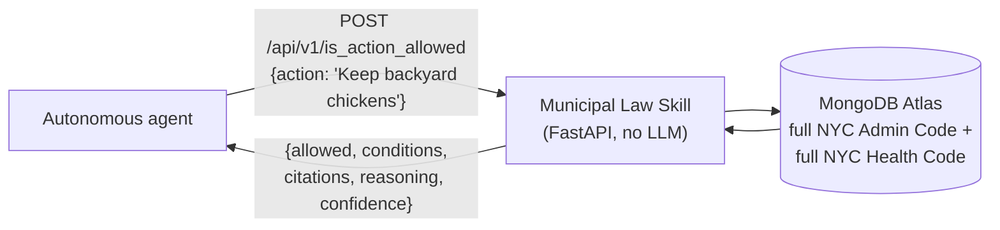

# Municipal Law Skill for Autonomous Agents

Any autonomous agent can determine whether an action is legal in New York City by invoking this skill. It provides deterministic, citation-backed access to municipal law without using an LLM, so every answer is grounded in the official code — not "search → 14 PDFs, good luck." Built for the MIT Hackathon as a reusable agent capability (a NANDA-style skill), not a bespoke chatbot: any agent that can call an HTTP endpoint can invoke it, per [SKILL.md](./SKILL.md).

The skill returns structured facts with citations and mechanical `reasoning` — never a fabricated answer. It never calls an LLM internally; see [SKILL.md](./SKILL.md) for exactly how a calling agent should compose its final response from what this API returns.

> **This service never generates legal answers.** It only returns authoritative legal evidence and citations. The calling agent performs the reasoning. Same query → same citations → same ordering, every time — no randomness, nothing to re-run for a different answer.

**The complete corpus, not a sample:**

| | Titles/Articles | Sections | Source |
|---|---|---|---|
| NYC Administrative Code | 32 | 4,781 | [nycadmincode.readthedocs.io](https://nycadmincode.readthedocs.io/) (CC0) |
| NYC Health Code | 36 | 501 | first-party PDFs, nyc.gov |

668 source documents, 10,702 searchable chunks total — see [docs/COVERAGE.md](./docs/COVERAGE.md) for the exact live manifest.

**Try it in one call:**

```bash
curl -X POST https://nanda-municipal-laws.vercel.app/api/v1/is_action_allowed \
  -H "Content-Type: application/json" -d '{"action": "Keep backyard chickens"}'
```

Design:
- **`is_action_allowed(action, context)`** — the headline tool: describe an action in plain language, get back `{allowed, conditions, citations, reasoning, confidence}`. Implemented as retrieval plus rules (keyword search + prohibition/permission classification), not LLM reasoning — `allowed` is only `true`/`false` when the corpus contains an explicit statement; otherwise it's `null` ("unclear"), never a guess from silence.
- **Deterministic search, no LLM in the loop**: `SEARCH_MODE=text_index` (default) uses native MongoDB `$text`/`textScore`; `in_app` uses a Python TF-style scorer instead — selectable per-request, no embeddings or vector DB either way. No fabricated answers, ever. The API returns ranked results with citations and a `reasoning` string; the caller decides how to use them.
- **Two real sources, ingested in full**: [nycadmincode.readthedocs.io](https://nycadmincode.readthedocs.io/) (CC0-licensed HTML mirror of the **entire** NYC Administrative Code — all titles) and first-party NYC Health Code PDFs at `nyc.gov` (**all** articles, including Article 161/§161.19, the chicken/poultry-keeping section). Two ingestion formats, one shared pipeline. See [docs/COVERAGE.md](./docs/COVERAGE.md) for exactly what's ingested, generated live from MongoDB.
- **Storage**: MongoDB (Atlas free tier — the full corpus, 668 documents / ~10,700 chunks, uses ~55 MB of the 512 MB M0 limit) — a single `dl-laws` collection.
- **Hosting**: Vercel free/Hobby tier (zero-config FastAPI/ASGI support), or any ASGI host via `uvicorn`.
- **Hardened for a public demo URL**: per-client rate limiting (10 req/min by default on read endpoints; a much stricter 1 req/min on `/ingest` since it triggers outbound fetches and Atlas writes), an optional shared-secret gate on `/ingest`, fast-fail Mongo timeouts, pinned dependencies, and a global exception handler that never leaks stack traces.

📖 **Full docs:** [docs/](./docs/) — [architecture](./docs/ARCHITECTURE.md), [API reference](./docs/API.md), [deployment](./docs/DEPLOYMENT.md), [data source](./docs/DATA_SOURCE.md). Agent-facing quick reference: [SKILL.md](./SKILL.md).

## How it works



See [docs/ARCHITECTURE.md](./docs/ARCHITECTURE.md) for the full ingestion-to-API data flow and decision-logic diagrams.

## Project layout

```text
app/            FastAPI app: config, db, rate limiting, retrieval, models, routers, ingestion pipeline
api/index.py    Vercel entrypoint (re-exports app.main:app)
scripts/        crawl_and_seed_admin_code.py, seed_all_health_code.py, generate_coverage_report.py
tests/          parser + ingestion + API + rate-limit + section/related/topic-filter tests (fake in-memory Mongo)
docs/           architecture, API reference, deployment, data source, COVERAGE.md (generated)
postman/        Postman collection + environments for testing the deployed API
local_agent/    local-only chat-loop agent simulating a real caller of this skill (never deployed - see below)
SKILL.md        agent-facing API reference (endpoints, curl, composing a final answer, usage steps)
```

## Local agent simulator

[`local_agent/`](./local_agent/) is a small, interactive chat-loop tool that plays the role of "an autonomous agent" invoking this skill exactly as `SKILL.md` describes: it reads a plain-English question, asks Claude Code (via the `claude` CLI you're already logged into - no separate API key needed) to decide which endpoint to call, calls the real API, and asks Claude to compose the final `{answer, sources, reasoning}`. It's local-only and excluded from the Vercel deployment ([`.vercelignore`](./.vercelignore)) - the deployed service itself never calls an LLM.

```bash
uvicorn app.main:app --reload      # in one terminal
python -m local_agent.cli           # in another
```

See [local_agent/README.md](./local_agent/README.md) for architecture, options, and its own test suite (`python -m pytest local_agent/tests -v`).

## Quick start

### 1. Set up MongoDB

1. Create a free MongoDB Atlas M0 cluster at https://www.mongodb.com/cloud/atlas.
2. Create a database user and, under Network Access, allow access from anywhere (`0.0.0.0/0`) so serverless functions can reach it. Only read/write on one collection (`dl-laws`) is required — no `createIndex` privilege needed.
3. Copy the SRV connection string.

### 2. Configure environment

```bash
cp .env.example .env
# edit .env: set MONGO_ATLAS_CONN_STR to your Atlas connection string
```

See [docs/DEPLOYMENT.md](./docs/DEPLOYMENT.md) for the full list of environment variables (rate limit, ingest API key, timeouts, etc).

### 3. Install dependencies and run locally

```bash
python -m venv .venv
.venv\Scripts\activate        # or: source .venv/bin/activate
pip install -r requirements-dev.txt
uvicorn app.main:app --reload
```

Check `GET http://localhost:8000/api/v1/health` returns `{"status": "ok"}` (requires a reachable Mongo).

### 4. Seed real law data

```bash
python -m scripts.crawl_and_seed_admin_code    # entire NYC Admin Code - takes a while (~30 min)
python -m scripts.seed_all_health_code         # every NYC Health Code article - a few minutes
```

The first crawls and ingests the **entire** NYC Administrative Code (all titles/chapters/subchapters — a few hundred pages). The second discovers and ingests **every** NYC Health Code article (including Article 161/§161.19, the chicken/poultry-keeping section). Both create a MongoDB text index along the way (best-effort). For a quick local smoke test instead of the full crawl, scope either down: `crawl_and_seed_admin_code.py --start-url "https://nycadmincode.readthedocs.io/t24/c02/"` or `seed_all_health_code.py --article 161`. After (re-)ingesting, run `python -m scripts.generate_coverage_report` to refresh [docs/COVERAGE.md](./docs/COVERAGE.md) with what's actually in the database.

### 5. Try it

```bash
curl -X POST http://localhost:8000/api/v1/is_action_allowed \
  -H "Content-Type: application/json" \
  -d '{"action": "Keep backyard chickens"}'

curl -X POST http://localhost:8000/api/v1/search \
  -H "Content-Type: application/json" \
  -d '{"query": "rooster keeping poultry", "document_type": "NYC Health Code"}'

curl http://localhost:8000/api/v1/sections/161.19
```

Note this is keyword search, not semantic search: term frequency drives ranking. It's also worth knowing that popular internet folklore claims NYC caps backyard chickens at "a maximum of 6 hens" — the real ingested text of §161.19 states no such number (see [docs/DATA_SOURCE.md](./docs/DATA_SOURCE.md)). More curl examples for every endpoint: [docs/API.md](./docs/API.md).

### 6. Run tests

```bash
python -m pytest tests/ -v
```

Tests run against a fake in-memory Mongo double (`tests/fake_mongo.py`), including the rate limiter, ingest auth gate, both ingestion formats, and the new section/related-laws/penalty/permit endpoints, so the full suite runs in well under a second with no live database needed.

### 7. Deploy to Vercel

```bash
npm i -g vercel      # if you don't already have the CLI
vercel dev            # sanity-check locally first
vercel                 # deploy
vercel env add MONGO_ATLAS_CONN_STR production
vercel env add INGEST_API_KEY production     # recommended before sharing the URL publicly
```

Full deployment walkthrough, env var table, and prod-readiness notes: [docs/DEPLOYMENT.md](./docs/DEPLOYMENT.md).

## API summary

All endpoints except `/` and `/skill.md` are under `/api/v1` and rate-limited per client IP (default 10 req/min, except `/ingest` at a stricter 1 req/min). Full reference with curl examples and sample responses: [docs/API.md](./docs/API.md).

| Endpoint | Method | Purpose |
|---|---|---|
| `/` | GET | Service info (not rate-limited) |
| `/skill.md` | GET | Serves the root `SKILL.md` as plain text (not rate-limited) |
| `/api/v1/health` | GET | `{"status": "ok" \| "degraded"}` based on live Mongo reachability |
| `/api/v1/version` | GET | `{"version": "..."}` |
| `/api/v1/is_action_allowed` | POST | `{action, context?, limit?}` → `{allowed, conditions, citations, reasoning, confidence}` — deterministic, no LLM |
| `/api/v1/search` | POST | `{query, limit?, title_num?, chapter_num?, document_type?, agency?, topic?, search_mode?}` → ranked `results` + `reasoning` |
| `/api/v1/sections/{section_number}` | GET | Exact lookup by section number — full metadata, cross-references, and a deterministic `structural_summary` |
| `/api/v1/sections/{section_number}/related` | GET | Resolves that section's cross-references into their own citations |
| `/api/v1/sections/{section_number}/term_map` | POST | `{query, context_chars?}` → search term map: every occurrence of each query term in the section, `<mark>`-highlighted with context — for search-results/demo UI rendering |
| `/api/v1/penalties` | POST | `{query?, topic?}` → results filtered to sections flagged as mentioning a penalty |
| `/api/v1/permits` | POST | `{query?, topic?}` → results filtered to sections flagged as mentioning a permit requirement |
| `/api/v1/documents/{id}` | GET | Document metadata (title/chapter/subchapter or article, source URL) |
| `/api/v1/documents/{id}/chunks` | GET | All chunks (sections) belonging to a document |
| `/api/v1/ingest` | POST | `{urls: [...]}` (max 10) — fetch, parse, and persist a bounded batch of pages/PDFs. Gated by `INGEST_API_KEY` if configured; limited to 1 req/min (its own stricter bucket). |

**Not supported** (documented, not faked): zoning lookup by address (needs GIS/PLUTO data, a different domain), and comparing two revisions of a section over time (needs historical snapshots this pipeline doesn't retain).

## Coverage

Both sources are ingested **in full** — the entire NYC Administrative Code (via `scripts/crawl_and_seed_admin_code.py`, which crawls the site's own table of contents rather than assuming a fixed depth) and every NYC Health Code article (via `scripts/seed_all_health_code.py`, which discovers the article list from `nyc.gov` rather than hardcoding it). **Exact current coverage** — every title/chapter/subchapter/article actually ingested, with section counts and links — is in [docs/COVERAGE.md](./docs/COVERAGE.md), generated live from MongoDB so it can't drift out of sync. `POST /api/v1/ingest` also works for ad hoc single-page/article additions. Re-ingesting an already-seen URL is idempotent. Details and known formatting quirks discovered along the way: [docs/DATA_SOURCE.md](./docs/DATA_SOURCE.md).

## Documentation index

This file covers quick-start and a high-level summary. Everything else lives in [docs/](./docs/) and the repo root:

| Page | Covers |
|---|---|
| [SKILL.md](./SKILL.md) | Agent-facing API reference: every endpoint with curl + example JSON, how a calling agent should compose `{answer, sources, reasoning}` from citations, and the rules for never overclaiming |
| [docs/ARCHITECTURE.md](./docs/ARCHITECTURE.md) | System design: data flow, `SourceLoader` ingestion pattern, storage schema, search-mode fallback, rate-limiting sequence, and `is_action_allowed` decision logic — with Mermaid diagrams |
| [docs/API.md](./docs/API.md) | Full REST reference: every endpoint, request fields, curl examples, sample responses, error codes |
| [docs/DEPLOYMENT.md](./docs/DEPLOYMENT.md) | MongoDB Atlas + Vercel free-tier setup, environment variable table, production-readiness notes |
| [docs/DATA_SOURCE.md](./docs/DATA_SOURCE.md) | Where the law text comes from, licensing, PDF/HTML parsing quirks discovered during ingestion, and known limitations (keyword vs. semantic search, coincidental keyword matches) |
| [docs/COVERAGE.md](./docs/COVERAGE.md) | Exact ingested coverage (every title/chapter/subchapter/article), generated live from MongoDB |
| [postman/README.md](./postman/README.md) | Postman collection for testing the deployed API — import instructions, Newman CLI usage, why the ingest/rate-limit folders are manual-only |
| [local_agent/README.md](./local_agent/README.md) | Local-only chat-loop agent that simulates a real caller of this skill (routes questions via the `claude` CLI, calls the real API, composes the final answer) — architecture, how to run it, and its own test suite |
