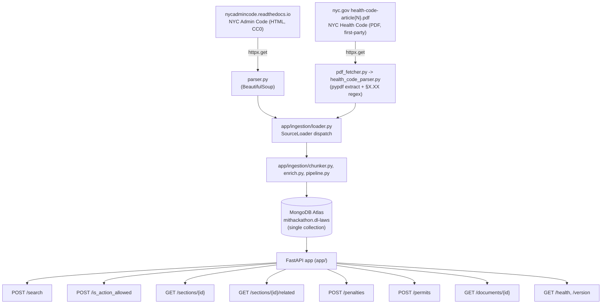
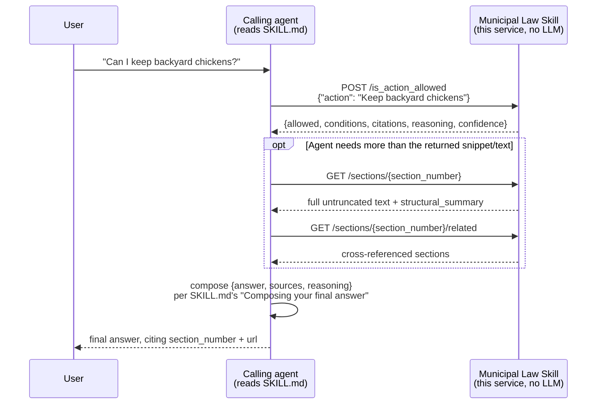
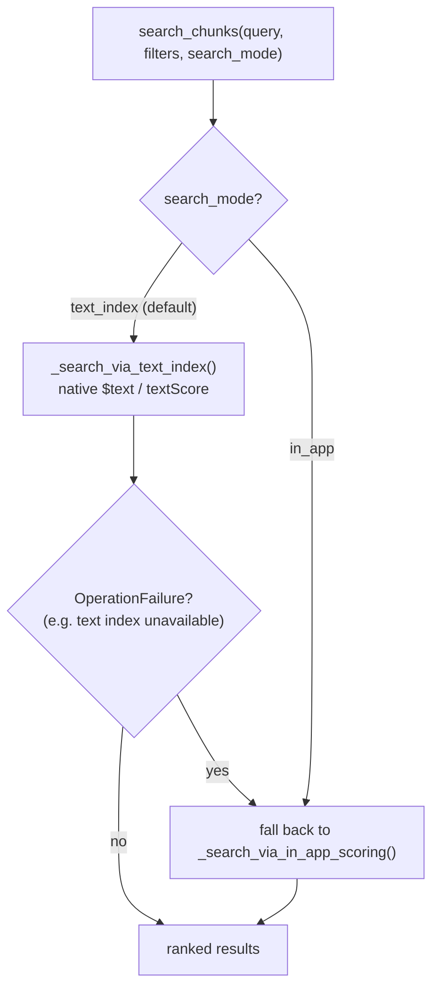
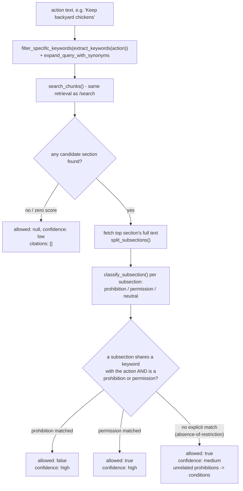
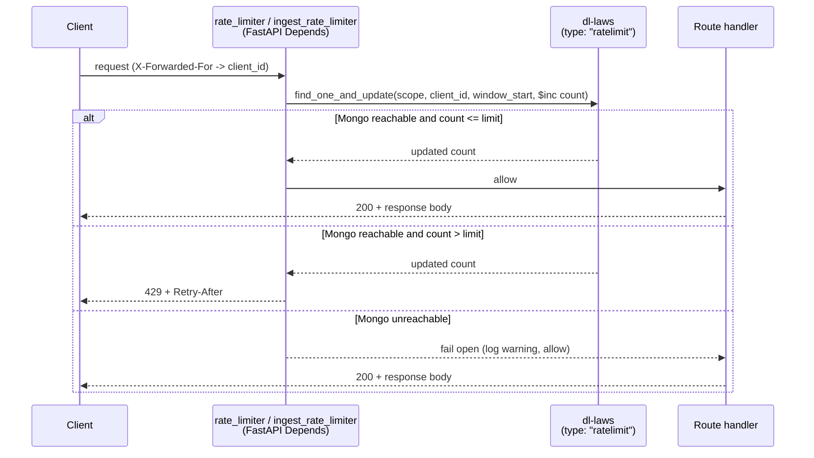

# Architecture

## Goal and scope

A reusable agent capability, not a bespoke chatbot backend: any autonomous agent can determine whether an action is legal in New York City by invoking this skill through a small, stateless REST API — search for relevant sections, look one up directly, resolve its cross-references, filter by penalty/permit relevance, then retrieve the full document/chunk for citation. Deterministic, citation-backed, explainable — rather than a RAG/LLM-answer system: no embeddings, no vector database, no LLM calls, no server-synthesized "answer." The API returns structured results plus a mechanical `reasoning` string explaining *how* a result was derived; the calling agent (see `SKILL.md`) composes the final natural-language answer, sources, and confidence from those citations.

## Data flow



Ingestion is on-demand and bounded (`POST /ingest`, max `INGEST_MAX_URLS` pages per call), not a background job — this runs as a Vercel serverless function with a hard execution-time ceiling, so there's no long-lived worker to schedule crawls.

## Agent workflow

The data flow above is how the corpus gets *into* the API; this is how a calling agent uses it once it's there. Every step is a plain HTTP call the API answers deterministically — nothing in this sequence involves an LLM on the server side.



For a general (non yes/no) question, the agent calls `POST /search` instead of `/is_action_allowed`; for a penalty- or permit-specific question, `POST /penalties`/`POST /permits`. See `SKILL.md`'s "How to use this service" for the exact routing rules.

## Multi-format ingestion: `SourceLoader`

Two independent sources, two formats (HTML admin code, PDF health code), one common output shape. `app/ingestion/loader.py` dispatches by URL suffix:

```python
def select_loader(url: str) -> SourceLoader:
    return PdfHealthCodeLoader() if url.lower().endswith(".pdf") else HtmlAdminCodeLoader()
```

Each loader's `.load(url)` returns `(SourceMetadata, list[SectionChunk])` — `app/ingestion/parser.py`'s `SourceMetadata` dataclass generalizes what used to be admin-code-specific `PageMetadata`: hierarchy fields (`title_num`/`chapter_num`/`subchapter_num` for admin code, `article_num`/`article_name` for health code) are all `Optional`, alongside required `document_type`/`agency`/`topic`. `app/ingestion/pipeline.py`'s `ingest_url(db, url)` persists whichever shape it receives without caring which loader produced it — the signature and every caller (`routers/ingest.py`, both seed scripts, all tests) are unchanged from v1.

**HTML path** (`fetcher.py` + `parser.py`, unchanged from v1): BeautifulSoup, breadcrumb-derived Title/Chapter/Subchapter, `section-XX-XXX` HTML anchors.

**PDF path** (new: `pdf_fetcher.py` + `health_code_parser.py`): `pypdf` extracts per-page text; article metadata comes from the PDF's own `ARTICLE {N}\n{NAME}` header text (not hardcoded to "161"/"Animals," so the loader works for other `health-code-article{N}.pdf` files later). Section headings (`§X.XX Title.`) are found via regex; a Health Code article PDF typically lists every section twice — once in a table-of-contents block, once as the real body — distinguished by checking the span of text between consecutive heading matches: a TOC entry's span (up to the next heading) is empty, a real section's is substantial. This was verified against a real downloaded article before writing the regex, not assumed (`tests/fixtures/health_code_article161.txt`, `tests/test_health_code_parser.py`). Citations use `#page=N` anchors (tracked via a page-offset table + `bisect`) instead of HTML fragment ids, since PDF viewers don't have per-section anchors — most PDF viewers honor `#page=N` directly.

Formatting is **not** uniform across all ~36 Health Code articles, discovered only by actually ingesting every one of them (not by reading one article and assuming the rest match): Article 161 spaces its headings as `"§161.19  Title."` (two spaces); Article 1 uses `"§1.01 Title."` (one space) and has no table-of-contents block at all (each heading appears exactly once, which the same "empty vs. substantial span" check handles correctly without special-casing). Article names can contain commas (Article 48: "DAY CAMPS, OVERNIGHT CAMPS, AND TRAVELING DAY CAMPS" broke an original `[A-Z \-]+` character class). Most articles say `"ARTICLE 121"`; Article 121 itself is typeset `"Article 121"` (title case). All three are pinned by fixtures/tests (`tests/fixtures/health_code_article1.txt`, `tests/test_health_code_parser.py::test_parse_health_code_handles_single_space_heading_format`) rather than special-cased silently — the regexes were loosened (variable spacing, unrestricted title characters, case-insensitive keyword) to genuinely handle the variation, not patched per-article.

## Metadata enrichment: one shared function, not per-loader

Per-chunk metadata (`keywords`, `cross_references`, `mentions_penalty`, `mentions_permit`, `jurisdiction`, `effective_date`, `repealed`) is purely a function of a chunk's own `(section_number, section_title, text)` — independent of which loader produced it — so it lives in one place, `app/ingestion/enrich.py::enrich_chunk()`, called once from `pipeline.py`. Deliberately deterministic, no fabrication:

- **`keywords`**: tokenized `section_title`, stopwords removed — no invented terms.
- **`cross_references`**: regex `§\s*(\d+[\-.]\d+)` over `text`, self-excluded. Requires the literal `§` glyph (not the word "section") specifically to avoid false positives from prose referencing external, differently-numbered statutes (e.g. real §161.19 text says "as defined in *section 4* of the Multiple Dwelling Law" — that's not one of our own sections and would never resolve if matched). A documented, honest limitation, not exhaustive cross-reference detection.
- **`mentions_penalty`** / **`mentions_permit`**: fixed keyword lists (`penalty`/`fine`/`violation`/`unlawful`/... and `permit`/`license`/`authorized`/...), matched on **word boundaries** (`re.search(rf"\b{keyword}\b", ...)`), not plain substring containment — caught during the real Atlas ingestion run: naive substring matching flagged §161.19 as mentioning a "fine" because "fine" is a substring of "def**ine**d" ("...as **defined** in section 4 of the Multiple Dwelling Law..."). Broad by design otherwise (`mentions_permit` includes "authorized," so it flags exception clauses too, not only affirmative permit-application sections) — a useful filter, not a legal determination. See [DATA_SOURCE.md](./DATA_SOURCE.md) for the full caveat.
- **`effective_date`**: always `null`. Neither source exposes a reliable machine-readable effective date without provision-by-provision legal research — refused to fabricate one rather than guess.
- **`repealed`**: defaults `false`, documented as an assumption (both sources serve current in-force text, not a historical snapshot).
- **`agency`**: a small static per-loader value, verified rather than assumed — the admin-code agency ("Department of Environmental Protection (DEP)") was confirmed against the *ingested Subchapter 1 text itself* ("Commissioner means commissioner of environmental protection"), not just general knowledge.

## Storage: one collection, not several

The MongoDB Atlas custom role provisioned for this project grants read/write on exactly one collection name (`dl-laws`) and nothing else — not even `createIndex`. All record kinds live in `dl-laws`, distinguished by a `type` field:

```jsonc
// type: "document" — one per ingested admin-code page or health-code article
{ "_id", "type": "document", "document_type", "agency", "topic",
  "title_num", "title_name", "chapter_num", "chapter_name", "subchapter_num", "subchapter_name",  // admin code, else null
  "article_num", "article_name",                                                                  // health code, else null
  "source_url", "ingested_at", "section_count" }

// type: "chunk" — one per section (or sub-split of a long section)
{ "_id", "type": "chunk", "document_id", "section_number", "section_title", "text", "chunk_index", "url",
  "title_num", "chapter_num", "subchapter_num", "article_num",           // whichever hierarchy applies
  "document_type", "agency", "topic", "ingested_at",
  "jurisdiction", "keywords", "cross_references", "mentions_penalty", "mentions_permit",
  "effective_date", "repealed" }

// type: "ratelimit" — per-client, per-scope request counters (see Rate limiting below)
{ "_id", "type": "ratelimit", "scope": "general" | "ingest", "client_id", "window_start", "count" }
```

`app/db.py` still calls `create_index(...)` for a handful of useful indexes (unique `source_url` for idempotent re-ingestion, a compound `(document_id, chunk_index)`, and `section_number`) but treats failure as **non-fatal** — if the Atlas role doesn't grant `createIndex`, a warning is logged and the app runs on unindexed collections. At this dataset's scale (a few hundred documents), that's a performance footnote, not a correctness problem.

**No separate migration/backfill tool for v2 fields**: `pipeline.ingest_url` already upserts documents and fully replaces chunks on every re-ingestion. Once `pipeline.py` computes the v2 fields, re-running the seed scripts regenerates every existing chunk with the new metadata for free, via the same idempotent mechanism.

## Search: two interchangeable modes, `$text` by default

Earlier in this project, the Atlas role couldn't grant `createIndex`, so search ran entirely as in-app Python scoring. That's since been confirmed fixed (the role now supports it — see `app/db.py::ensure_indexes()`, which now also creates a weighted text index on `section_title`/`text`), and the corpus grew from ~150 chunks to several thousand across the full NYC Administrative Code and NYC Health Code, at which point fetching every filter-matching chunk into Python per search stops being "fine at this scale." So `app/retrieval.py::search_chunks()` now supports **two interchangeable strategies**, chosen by `settings.search_mode` (env var `SEARCH_MODE`, default `"text_index"`) or overridden per-request via `SearchRequest.search_mode`/`TopicFilterRequest.search_mode`:

- **`"text_index"` (default)**: native MongoDB `$text`/`textScore` — the database does the filtering and ranking, so it scales to a large corpus without pulling every candidate into the API process.
- **`"in_app"`**: the original `app/search_scoring.py` TF-style scorer — fetches every filter-matching chunk and scores in Python. No index dependency, but degrades as the corpus grows; kept as a documented, selectable fallback rather than deleted, since it's what let this project work before `createIndex` was confirmed available, and it's what the `text_index` path automatically falls back to (catching `OperationFailure`) if the text index is ever unavailable again.



`app/search_scoring.py` (and the test suite's `$text` emulation in `tests/fake_mongo.py`) match on word boundaries, not plain substrings — a real bug caught while building `/is_action_allowed`: naive `str.count()` matched "dance" inside "accor**dance**" and would have matched "fine" inside "de**fine**d" (the same class of bug already fixed once in `app/ingestion/enrich.py`'s `mentions_penalty`/`mentions_permit`, and evidently not yet applied everywhere it should have been).

Both modes are implemented in one place (`_search_via_text_index`/`_search_via_in_app_scoring` in `app/retrieval.py`), used identically by `/search`, `/penalties`, and `/permits`, so the retrieval logic isn't duplicated per endpoint. Filters include `document_type`/`agency`/`topic`/`title_num`/`chapter_num`, plus `mentions_penalty`/`mentions_permit` for the topic-filter endpoints — applied identically regardless of which scoring mode is active.

Either way, this is a keyword search, not a semantic one — term frequency (Python TF or MongoDB's own relevance scoring) drives ranking, not phrase meaning. Documented as a real, user-visible limitation in [DATA_SOURCE.md](./DATA_SOURCE.md) and `SKILL.md`, not hidden: e.g. a bare "noise" query ranks § 24-220 ("Noise mitigation plan") above § 24-222 ("After hours and weekend limits on construction work"), since 24-222's body text never uses the word "noise" at all.

## Citation graph, without a graph database

"Citation graph traversal" is approximated cheaply and deterministically: every chunk carries a `cross_references` array (extracted at ingestion time, above). `GET /sections/{id}/related` resolves those references with plain `find_one` lookups against the same collection — a real one-hop graph traversal in spirit, no new infrastructure. Unresolved references (pointing outside the ingested corpus — confirmed with a real example: §161.07 cites §3.07 of the Health Code, which isn't ingested) are returned with `"resolved": false` rather than silently dropped, preserving traceability over a clean-looking but misleading response.

## `GET /sections/{id}`: structural summary, not abstractive summarization

`summarize_law` is folded into the section-lookup response as `structural_summary`: a deterministic split on sentence-bounded lettered/numbered subsection markers (`re.split(r"(?<=[.;]\s)(?=\([a-z0-9]+\)\s)", text)`, `app/routers/sections.py`). The lookahead requires the marker to follow a sentence boundary specifically because mid-sentence parenthetical cross-references (e.g. real §161.19 text: "...as authorized by §161.01 **(a)** of this Article") look syntactically identical to a real subsection marker — verified against real text before finalizing the regex, not assumed.

## `POST /is_action_allowed`: retrieval plus rules, not LLM reasoning

The headline capability, positioning this as a reusable agent skill ("determine whether an action is legal") rather than a generic search API. `app/action_evaluator.py::evaluate_action()` composes existing building blocks rather than introducing a new retrieval path:

1. Build a search query from the action's *specific* keywords only (`app/action_rules.py::filter_specific_keywords`, which drops generic regulatory verbs — "keep," "operate," "use" — that are common enough across the corpus to dominate ranking; a real ranking failure caught while building this: a raw query for "keep a rooster" was outranked by "Permits to keep certain animals," matched purely on the word "keep"), expanded with a small curated synonym list (`ACTION_QUERY_SYNONYMS` — e.g. "chicken" → "poultry," since the real §161.19 text never uses the word "chicken" at all; confirmed empirically, not assumed, before deciding this bridge was necessary).
2. Run that query through the same `app/retrieval.py::search_chunks()` used by `/search`.
3. Fetch the top-matching section's full text and split it into subsections (the same `app/text_structure.py::split_subsections()` used by `/sections/{id}`'s `structural_summary`).
4. Classify each subsection as `prohibition`/`permission`/`neutral` via a fixed, word-boundary-matched keyword list (`app/action_rules.py::classify_subsection()` — the same approach as `mentions_penalty`/`mentions_permit`), and check whether it shares a specific keyword with the action.



`allowed` is only ever `true`/`false` when a keyword-matched, explicit prohibition or permission statement was found — never inferred from silence. When the closest-matching section contains no explicit statement about the action's own subject, the response still returns `allowed: true` but capped at `confidence: "medium"` (an absence-of-restriction inference is a materially weaker claim than an affirmative statement) and surfaces any *unrelated* prohibitions found in the same section as `conditions` — this is precisely how "keep backyard chickens" surfaces the rooster prohibition as a caveat without incorrectly citing it as a blocking rule for hens specifically.

**A known, deliberately undocumented-not-hidden limitation**: ranking by shared keywords means a query overlapping an unrelated section on one common word can produce a misleadingly confident-looking result. Found empirically while testing: a nonsense action ("launch a satellite from my roof") matched an unrelated building-construction section on the word "roof" (meaning roofing material, not rooftop location) and returned `allowed: false` citing real but off-topic text; similarly "party" (a legal term for a party to an action) coincidentally matched an unrelated section for a query about a celebration. The citation and matched text are always real — this isn't fabrication — but the *selected section* can be wrong for homonym/ambiguous terms, which is exactly the kind of disambiguation that requires semantic understanding this deliberately-non-LLM design doesn't attempt. Pinned by `tests/test_is_action_allowed.py::test_known_limitation_coincidental_common_word_can_still_match` and documented in `SKILL.md`'s Rules section (always read `reasoning` before trusting `allowed`) rather than silently patched with a threshold that would risk breaking the correct cases.

## Rate limiting: MongoDB-backed, not in-memory

Vercel serverless functions don't share process memory across invocations or cold starts, so a naive in-process rate limiter (a `dict` of counters) would not enforce a real per-client limit once traffic spans more than one warm instance. `app/rate_limit.py` implements two FastAPI dependencies backed by the same mechanism: `rate_limiter` (applied to `search`, `is_action_allowed`, `sections`, `penalties`, `permits`, `documents`, and `health` routers, default `RATE_LIMIT_PER_MINUTE` = 10) and `ingest_rate_limiter` (applied only to the `ingest` router, default `INGEST_RATE_LIMIT_PER_MINUTE` = 1 — much stricter, since that endpoint triggers outbound fetches and Atlas writes rather than just reads). Both call a shared `_check_rate_limit(request, db, scope, limit)` helper that increments a per-minute counter document in `dl-laws` (`type: "ratelimit"`, keyed by `scope` + `client_id` + `window_start`) via an atomic `find_one_and_update` with `$inc`, and rejects with `429` once the count for that scope exceeds its limit in the current 60-second window. The `scope` field keeps the two limiters' counters independent, so a client hitting `/ingest` once doesn't eat into their `/search` budget or vice versa. Client identity is best-effort: the first IP in `X-Forwarded-For` (Vercel's proxy header), falling back to the raw socket address.

It **fails open**: if Mongo is unreachable, the limiter logs a warning and lets the request through rather than taking the whole API down over a rate-limiting hiccup. Stale rate-limit documents are cleaned up opportunistically (a small random-chance `delete_many` on old windows) rather than via a TTL index, since TTL indexes also require `createIndex`.



## Why a FastAPI dependency, not ASGI middleware, for rate limiting and auth

Both rate limiters and the `/ingest` API-key gate are implemented as FastAPI `Depends()` functions rather than Starlette `BaseHTTPMiddleware`. Middleware runs outside FastAPI's dependency-injection graph, so it can't be swapped out via `app.dependency_overrides` in tests — a middleware-based limiter would have forced every test through a real (and in CI, unreachable) MongoDB connection, which is slow and flaky. As a dependency, `rate_limiter`/`ingest_rate_limiter` each take `db: Database = Depends(get_db)`, so tests override `get_db` exactly once and every dependent — routes and both rate limiters alike — automatically uses the fake in-memory Mongo double (`tests/fake_mongo.py`).

## Deferred, documented, not built: `find_zoning`, `compare_versions`

`find_zoning(address)` would need NYC GIS/PLUTO address-to-zoning-district resolution — a wholly different data domain this ingestion pipeline can't produce. `compare_versions(section_a, section_b)` would need historical snapshots the pipeline doesn't retain (each re-ingestion replaces a section's chunks outright). Both are documented as unsupported in `SKILL.md` rather than faked with a stub endpoint that returns nothing real — an honest "not supported" is more useful to an agent than a route that looks real but can't answer.

## Directory layout

```text
app/
  main.py              FastAPI app, middleware, routers, global exception handler
  config.py            pydantic-settings: all env-configurable behavior
  db.py                Mongo client singleton, collection name, best-effort index creation
  models.py            Pydantic request/response schemas
  search_scoring.py    in-app keyword scoring (see "Search" above)
  retrieval.py          shared filtered-search + scoring + reasoning-string builder
  action_evaluator.py    is_action_allowed decision logic (retrieval + rules, not LLM)
  action_rules.py         prohibition/permission classification, keyword filtering, action-query synonyms
  text_structure.py       shared subsection-splitting (used by /sections/{id} and the action evaluator)
  section_lookup.py       shared get_section_chunks (used by /sections/{id} and the action evaluator)
  rate_limit.py         Mongo-backed per-client, per-scope rate limiting dependencies
  routers/               search, is_action_allowed, sections (+/related), penalties, permits, documents, ingest, health/version
  ingestion/
    fetcher.py, parser.py, chunker.py     HTML admin-code path (v1)
    pdf_fetcher.py, health_code_parser.py PDF health-code path (v2)
    loader.py                              SourceLoader dispatch
    enrich.py                              shared per-chunk metadata enrichment
    pipeline.py                            persistence, source-agnostic
api/index.py            Vercel entrypoint (re-exports app.main:app)
scripts/
  crawl_and_seed_admin_code.py   crawl + ingest the entire NYC Administrative Code (--start-url/--limit to scope)
  seed_all_health_code.py        discover + ingest every NYC Health Code article (--article/--limit to scope)
  generate_coverage_report.py    regenerate docs/COVERAGE.md from live MongoDB contents
tests/                   parser + ingestion + API + rate-limit + section/related/topic-filter tests, run against a fake Mongo
docs/                    this folder, including COVERAGE.md (generated)
```

## Testing strategy

No live MongoDB is required to run the test suite. `tests/fake_mongo.py` implements the small subset of the pymongo API this app actually uses (equality `find`/`find_one`, `find_one_and_update` with `$set`/`$inc`, `insert_many`, `delete_many`) as a pure-Python in-memory double, injected via `app.dependency_overrides[get_db]`. Ingestion tests monkeypatch `fetcher.fetch_page` / `pdf_fetcher.fetch_pdf_pages` to return real, committed fixtures (`tests/fixtures/t24_c02_sch04.html` and `tests/fixtures/health_code_article161.txt`, both actual fetched/extracted content from the live sources) rather than synthetic markup, so both parsers are pinned against genuine text. A regression guard specifically asserts the ingested §161.19 text contains neither "6 hens" nor "maximum" — protecting against ever fabricating that popular myth into the service's own data. The full suite runs in well under a second.
