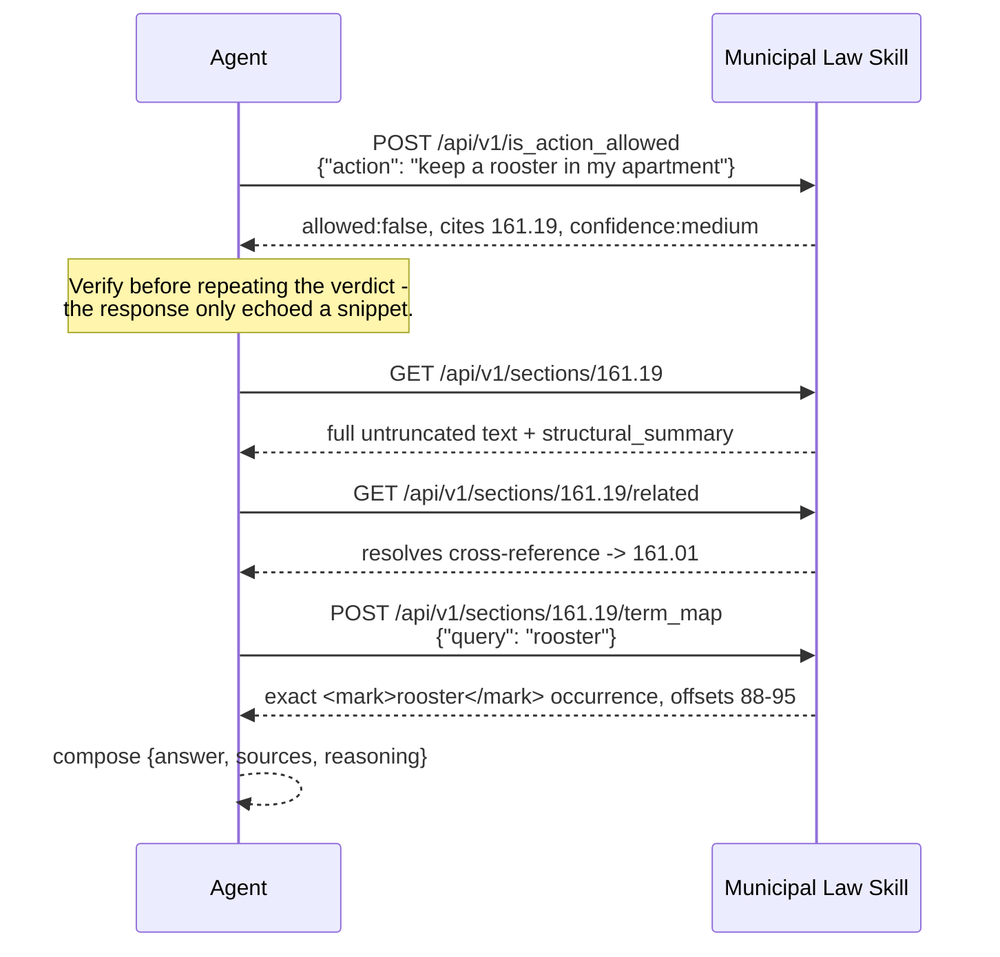
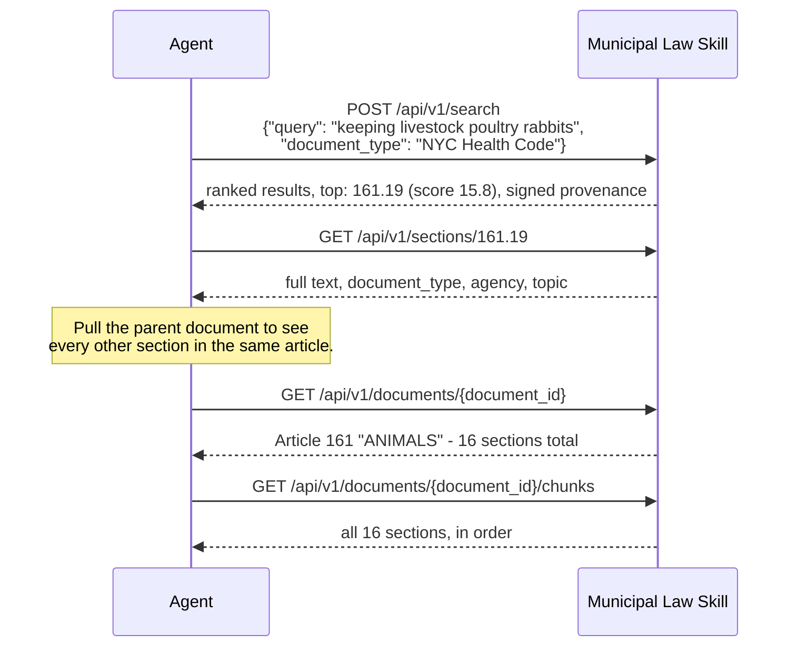
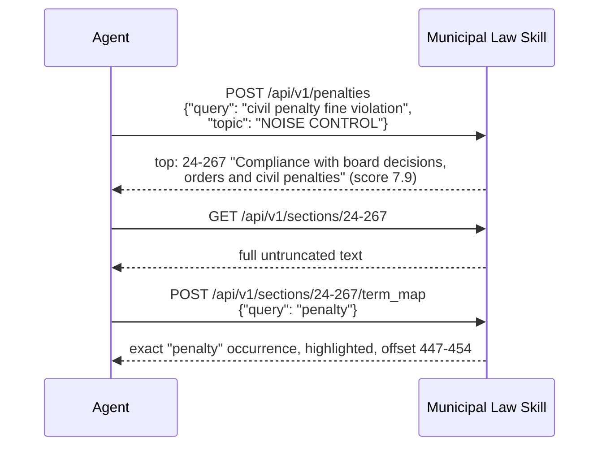
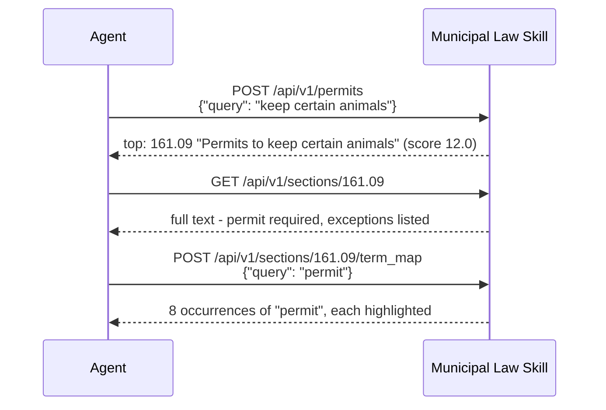
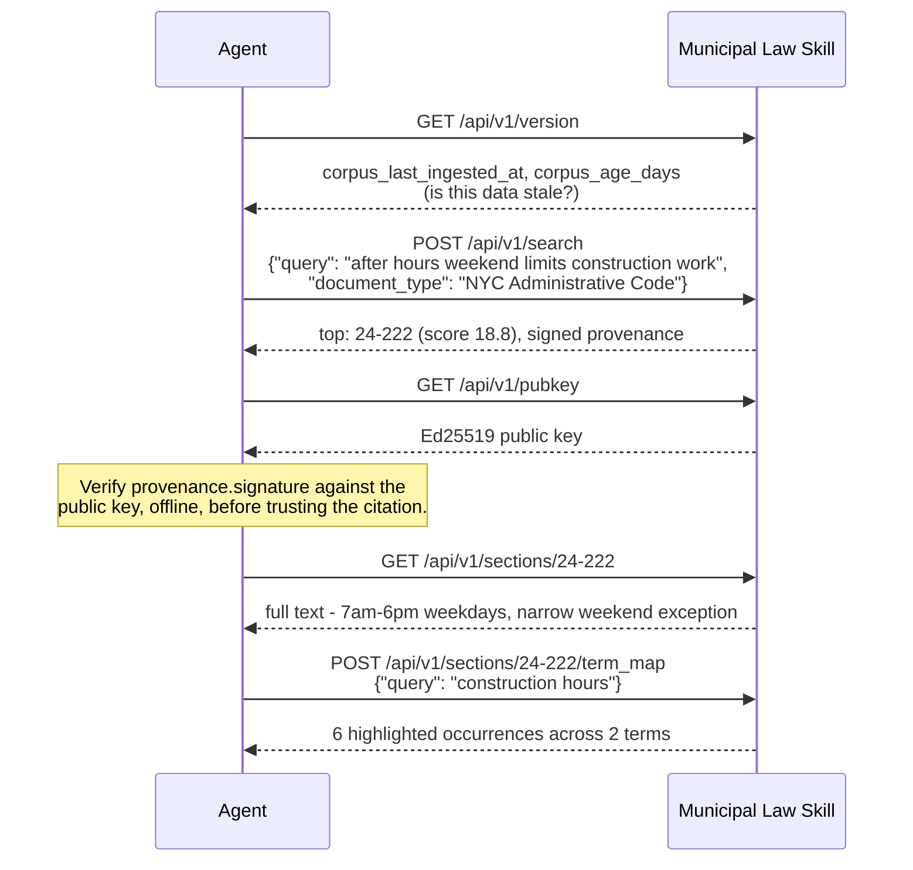

# Demo workflows: diagrams + runnable curl

Five agent workflows, each as a Mermaid sequence diagram (renders natively on GitHub) followed by the exact curl commands to run it — every response shown below is real, copied verbatim from the live deployment while writing this doc, not invented. Together they exercise every agent-facing endpoint this service exposes: `is_action_allowed`, `search`, `sections/{id}`, `sections/{id}/related`, `sections/{id}/term_map`, `penalties`, `permits`, `documents/{id}`, `documents/{id}/chunks`, `version`, and `pubkey`.

For the video-narration version of workflow 1, see [DEMO_SCRIPT.md](./DEMO_SCRIPT.md). This doc is the visual/copy-paste reference — pull it up on a second monitor during a live demo, or hand it to a judge to read in 30 seconds.

**Base URL for every command below**: `https://nanda-municipal-laws.vercel.app` (live, public, rate-limited to 10 req/min — see [DEPLOYMENT.md](./DEPLOYMENT.md)). Swap it for `http://localhost:8000` to run against a local `uvicorn app.main:app --reload` instead.

## About "click to run"

A plain GitHub-rendered markdown page can't execute anything — GitHub sanitizes rendered HTML and runs no JavaScript, so a code block is copy-paste only, not click-to-execute, no matter how it's formatted. Two real options instead, both linked per-workflow below:

1. **Swagger UI's "Try it out"** ([`/docs`](https://nanda-municipal-laws.vercel.app/docs)) — genuinely clickable and executable: expand the named tag, click **Try it out**, the request body is already pre-filled with a realistic example (added specifically for this), click **Execute**, see the real live response. This is the closest thing to "click and it runs" that exists for this API.
2. **[`docs/demo.html`](./demo.html)** — a self-contained page with real **Run** buttons that call the live API directly from your browser (`fetch()`, no server involved) and render the actual response inline. It's committed to this repo so it's "on GitHub," but GitHub itself won't execute its JavaScript when you view it on github.com (same sanitization as above) — **download the file and open it locally** (double-click, no install needed) for it to actually run, or serve it via GitHub Pages if you want a hosted link. See that file's own header comment for exact steps.

## Workflow 1 — The headline capability: ask, then verify before trusting it

Demonstrates `is_action_allowed`, `sections/{id}`, `sections/{id}/related`, `sections/{id}/term_map`. The question: *"Can I keep a rooster in my apartment?"*



**Try it in Swagger**: [`/docs`](https://nanda-municipal-laws.vercel.app/docs) → expand **Legal Determination**, then **Lookup**, **Cross References**, **Search** for the later steps.

```bash
BASE=https://nanda-municipal-laws.vercel.app

# 1. Ask the headline endpoint
curl -s -X POST $BASE/api/v1/is_action_allowed \
  -H "Content-Type: application/json" \
  -d '{"action": "keep a rooster in my apartment"}'
# -> {"allowed":false,"citations":[{"section_number":"161.19",...}],"confidence":"medium",...}

# 2. Verify: pull the full, untruncated text before quoting it
curl -s $BASE/api/v1/sections/161.19

# 3. Verify: follow the statute's own cross-reference one hop
curl -s $BASE/api/v1/sections/161.19/related
# -> resolves to 161.01 "Wild and other animals prohibited"

# 4. Make the citation auditable: highlight exactly where "rooster" occurs
curl -s -X POST $BASE/api/v1/sections/161.19/term_map \
  -H "Content-Type: application/json" -d '{"query": "rooster"}'
# -> "…keep a live <mark>rooster</mark>, duck, goose or turkey…" at offset 88-95
```

## Workflow 2 — General search, then drill into the source document

Demonstrates `search` (Health Code), `sections/{id}`, `documents/{id}`, `documents/{id}/chunks`. The question: *"What does the health code say about keeping livestock, poultry, and rabbits?"* — a general lookup, not a yes/no legality check, so the agent uses `/search` instead of `/is_action_allowed`.



**Try it in Swagger**: expand **Search** for the first call, **Lookup** for the rest.

```bash
BASE=https://nanda-municipal-laws.vercel.app

# 1. General search, scoped to one source
curl -s -X POST $BASE/api/v1/search \
  -H "Content-Type: application/json" \
  -d '{"query": "keeping livestock poultry rabbits", "document_type": "NYC Health Code"}'
# -> top result: 161.19 "Keeping of livestock, live poultry and rabbits", score 15.77
#    (this response is signed - see provenance.signature - and covers the same section as Workflow 1)

# 2. Full text of the top result
curl -s $BASE/api/v1/sections/161.19

# 3. The parent document this section belongs to
curl -s $BASE/api/v1/documents/6a4fd2c715b3681819635fd9
# -> {"document_type":"NYC Health Code","article_num":"161","article_name":"ANIMALS","section_count":16,...}

# 4. Every section in that document (161.01, 161.09, 161.15, 161.19, ...)
curl -s $BASE/api/v1/documents/6a4fd2c715b3681819635fd9/chunks
```

## Workflow 3 — Penalty search: find the fine, then verify the exact wording

Demonstrates `penalties`, `sections/{id}`, `sections/{id}/term_map`. The question: *"What's the civil penalty for a noise-code violation?"*



**Try it in Swagger**: expand **Penalties**, then **Lookup** and **Search**.

```bash
BASE=https://nanda-municipal-laws.vercel.app

# 1. Filter to penalty-flagged sections, ranked by a real query (not just a topic filter,
#    which returns unscored results - see the reasoning field's own caveat if you omit query)
curl -s -X POST $BASE/api/v1/penalties \
  -H "Content-Type: application/json" \
  -d '{"query": "civil penalty fine violation", "topic": "NOISE CONTROL"}'
# -> top result: 24-267 "Compliance with board decisions; orders and civil penalties", score 7.89

# 2. Full text - confirm the actual penalty language, not just the flagged snippet
curl -s $BASE/api/v1/sections/24-267

# 3. Highlight exactly where "penalty" occurs
curl -s -X POST $BASE/api/v1/sections/24-267/term_map \
  -H "Content-Type: application/json" -d '{"query": "penalty"}'
# -> "…A civil <mark>penalty</mark> imposed by the board pursuant to section 24-257…" at offset 447-454
```

## Workflow 4 — Permit search: does this require a permit, and which one?

Demonstrates `permits`, `sections/{id}`, `sections/{id}/term_map`. The question: *"Do I need a permit to keep certain animals?"*



**Try it in Swagger**: expand **Permits**, then **Lookup** and **Search**.

```bash
BASE=https://nanda-municipal-laws.vercel.app

# 1. Filter to permit-flagged sections
curl -s -X POST $BASE/api/v1/permits \
  -H "Content-Type: application/json" -d '{"query": "keep certain animals"}'
# -> top result: 161.09 "Permits to keep certain animals", score 12.04

# 2. Full text
curl -s $BASE/api/v1/sections/161.09

# 3. Highlight every occurrence of "permit" - 8 real hits in this section
curl -s -X POST $BASE/api/v1/sections/161.09/term_map \
  -H "Content-Type: application/json" -d '{"query": "permit"}'
# -> 8 occurrences, e.g. "(a) <mark>Permit</mark> required...", "...without a <mark>permit</mark> issued by the Commissioner..."
```

## Workflow 5 — Full chain with cryptographic verification

The "everything" workflow: `search`, `sections/{id}`, `sections/{id}/term_map`, `version`, `pubkey` — plus verifying the response's Ed25519 signature offline, so a downstream agent can prove this exact service produced these exact citations (see [PROVENANCE.md](./PROVENANCE.md)). The question: *"What are the after-hours limits on construction work?"*



**Try it in Swagger**: expand **Administration** (version, pubkey), **Search**, and **Lookup**.

```bash
BASE=https://nanda-municipal-laws.vercel.app

# 1. Is the corpus fresh?
curl -s $BASE/api/v1/version
# -> {"version":"0.1.0","corpus_last_ingested_at":"2026-07-09T17:59:16.627000","corpus_age_days":1}

# 2. Search - this response is Ed25519-signed
curl -s -X POST $BASE/api/v1/search \
  -H "Content-Type: application/json" \
  -d '{"query": "after hours weekend limits construction work", "document_type": "NYC Administrative Code"}'
# -> top: 24-222 "After hours and weekend limits on construction work", score 18.76
#    "provenance": {"signature": "7917289b...", "public_key": "8242e6c6...", "algorithm": "ed25519", ...}

# 3. Fetch the public key and verify that signature offline (see docs/PROVENANCE.md for the
#    exact canonicalization recipe + a runnable Python verify() function)
curl -s $BASE/api/v1/pubkey
# -> {"public_key": "8242e6c692bda6d9c4cf28dec90ce036e6732ca1a4c32060f76492d755ac727c", "algorithm": "ed25519", ...}

# 4. Full text of the top result
curl -s $BASE/api/v1/sections/24-222

# 5. Highlight both query terms
curl -s -X POST $BASE/api/v1/sections/24-222/term_map \
  -H "Content-Type: application/json" -d '{"query": "construction hours"}'
# -> 3 occurrences of "construction", 3 of "hours" - 6 total, each <mark>-highlighted
```

## Endpoint coverage across all 5 workflows

| Endpoint | Workflow(s) |
|---|---|
| `POST /is_action_allowed` | 1 |
| `POST /search` | 2, 5 |
| `GET /sections/{id}` | 1, 2, 3, 4, 5 |
| `GET /sections/{id}/related` | 1 |
| `POST /sections/{id}/term_map` | 1, 3, 4, 5 |
| `POST /penalties` | 3 |
| `POST /permits` | 4 |
| `GET /documents/{id}` | 2 |
| `GET /documents/{id}/chunks` | 2 |
| `GET /version` | 5 |
| `GET /pubkey` | 5 |

`GET /health`, `GET /skill.md`, `GET /`, and `POST /ingest` are intentionally not part of any workflow above — they're operational/meta endpoints, not part of the retrieval surface an agent reasons over (see each one's own description in [API.md](./API.md)).
