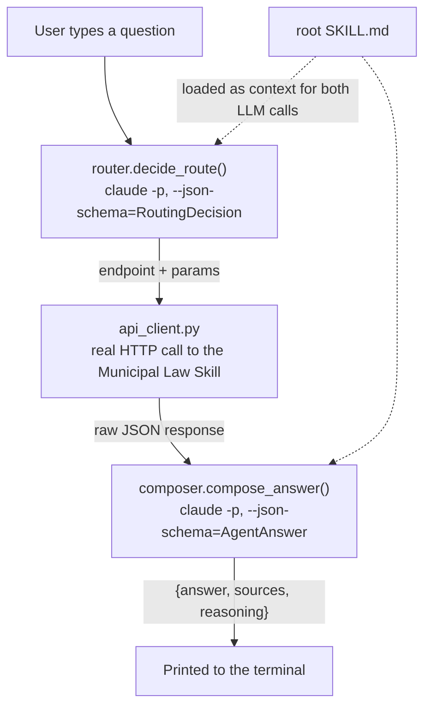

# Local agent simulator

A small, **local-only** stand-in for what SKILL.md tells any autonomous agent to do: read the skill's own instructions, decide which endpoint answers a plain-English question, call the real Municipal Law Skill API, and compose the final `{answer, sources, reasoning}` response. It exists to demo/exercise the skill the way a real calling agent would, from an interactive chat loop, without needing a browser or a curl command.

**This directory is never deployed.** It's excluded from the Vercel build via [`.vercelignore`](../.vercelignore) and nothing under `app/` or `api/` imports from it. The deployed service stays exactly what it's always been: a deterministic REST API with no LLM calls of its own. This package is a *client* of that API, run entirely on your machine.

## Why no separate LLM API key

The agent needs one LLM call to route a natural-language question to the right endpoint, and one more to compose the final answer from the API's response. Rather than requiring a separate `ANTHROPIC_API_KEY`/`OPENAI_API_KEY`, it shells out to the `claude` CLI you're already using (`local_agent/claude_cli.py`, via `claude -p ... --output-format json --json-schema ...`) - it rides on your existing Claude Code login. That's also why this is a local-only dev tool: a deployed server should never shell out to a CLI like this, and Claude Code itself isn't something you'd install on a serverless function anyway.

Every call to the real `claude` CLI costs a small amount of real usage and takes several seconds (structured output plus loading SKILL.md as context) - expect ~10-15s per question in the interactive CLI.

## Requirements

Nothing new - `local_agent` only uses dependencies already in `requirements.txt` (`httpx`, `pydantic`, `pydantic-settings`) plus the stdlib `subprocess`. You do need the `claude` CLI itself on `PATH` and logged in (`claude --version` should work).

## Running it

Point it at a running Municipal Law Skill instance - either your own local dev server or the live Vercel deployment:

```bash
# In one terminal: run the API locally
uvicorn app.main:app --reload

# In another: run the agent
python -m local_agent.cli
```

```
Municipal Law Skill - local agent simulator
Base URL: http://localhost:8000
Type a question in plain English (e.g. "Can I keep backyard chickens in Queens?").
Type 'exit' or 'quit' to leave.

you> Can I keep backyard chickens?

agent> Keeping backyard chickens (hens) is not explicitly prohibited under
section 161.19...

sources:
  - 161.19: https://www.nyc.gov/assets/doh/downloads/pdf/about/healthcode/health-code-article161.pdf#page=14 (score 10.0)

reasoning: The API returned allowed:true at confidence:medium - an
absence-of-restriction inference, not an explicit permission statement...
```

Options:

```bash
python -m local_agent.cli --api-base-url https://nanda-municipal-laws.vercel.app
python -m local_agent.cli --model opus
```

Or set `AGENT_API_BASE_URL` / `AGENT_CLAUDE_MODEL` in a `.env.agent` file (gitignored, kept separate from the server's own `.env`).

## Architecture



- **`skill_context.py`** — loads the repo's root `SKILL.md` once (the same file served live at `GET /skill.md`).
- **`claude_cli.py`** — the only place that shells out to `claude`. Runs one non-interactive turn with `--json-schema` (generated from a pydantic model via `.model_json_schema()`), and returns the CLI's own schema-validated `structured_output` - re-validated again with pydantic as a second, independent check.
- **`router.py`** — asks Claude to pick one endpoint + parameters, following SKILL.md's own "How to use this service" rules; validates into `RoutingDecision`.
- **`api_client.py`** — a thin `httpx` wrapper over the documented public HTTP contract (deliberately does not import `app.*` server internals - it only knows what SKILL.md/`docs/API.md` document, so it exercises the real, public contract).
- **`composer.py`** — asks Claude to synthesize the final `{answer, sources, reasoning}` from the raw API response, following SKILL.md's "Composing your final answer" and "Rules" sections (never state a fact absent from the returned `text`, always cite `section_number`/`url`, never overstate `allowed` past what `reasoning` supports).
- **`agent.py`** — ties the three steps together.
- **`cli.py`** — the interactive chat loop.
- **`smoke_test.py`** — manual, opt-in end-to-end script using the *real* `claude` CLI (see below).

## Tests

```bash
python -m pytest local_agent/tests -v
```

Layered, matching the main server test suite's philosophy (no live network, no live Mongo, fast and deterministic):

- **`test_claude_cli.py`** — unit tests for the subprocess wrapper, with `subprocess.run` itself faked (missing binary, non-zero exit, malformed JSON, `is_error`, missing `structured_output`, timeout). No real CLI call.
- **`test_router.py`** / **`test_composer.py`** — unit tests with `ask_structured` faked, checking the right prompts/schemas are built and the response validates into the right pydantic model.
- **`test_api_client.py`** — hits the **real, in-process FastAPI app** (via `local_agent/tests/conftest.py`'s `seeded_client`/`api_client` fixtures, which reuse the main suite's `tests/fake_mongo.py` double and ingest the real Article 161 fixture) - so these tests exercise real retrieval/`is_action_allowed` logic, not a mock of it.
- **`test_agent_integration.py`** — the full `Agent.ask()` path: real API logic (via the fixtures above) + faked Claude CLI calls for routing and composing. The closest thing to "run the whole agent" that stays offline, free, and deterministic.
- **`test_cli.py`** — REPL wiring (argument parsing, the input loop, exit/EOF handling) with a fake `Agent`.
- **`smoke_test.py`** is intentionally **not** part of this pytest run - see its own docstring. Run it manually (`python -m local_agent.smoke_test`) when you want to sanity-check the real `claude` CLI talking to a real running server end to end; it costs a small amount of real Claude usage and isn't deterministic enough to assert exact wording against in CI.
